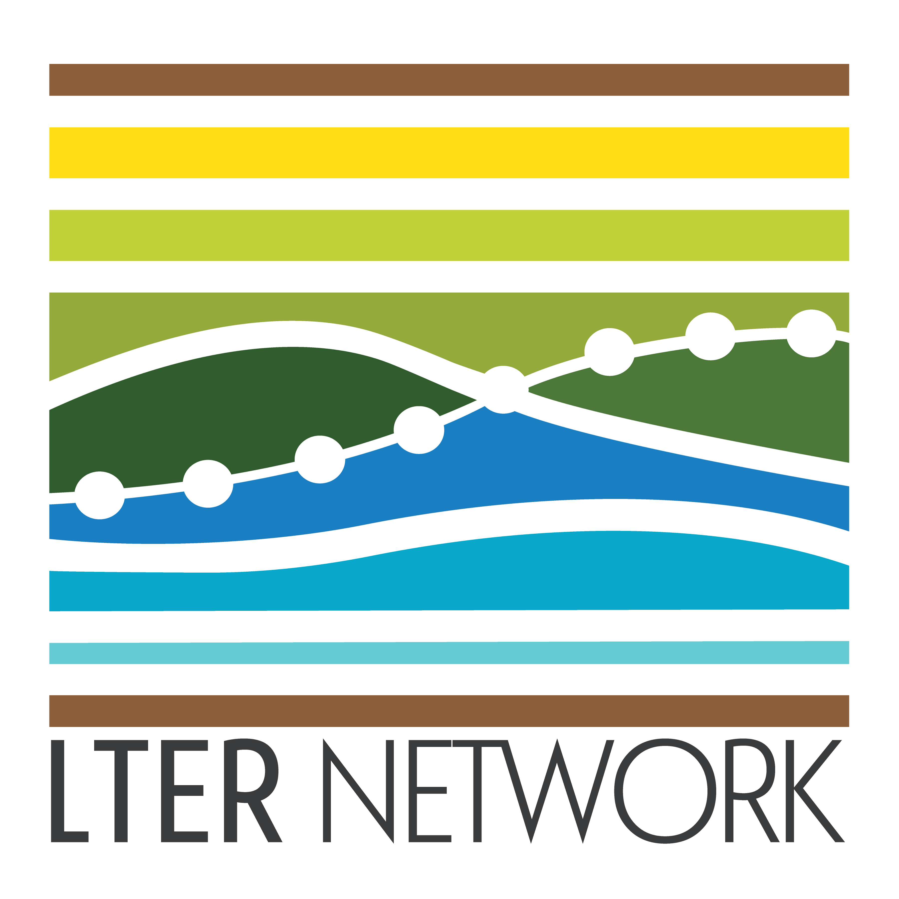

```{r setup, include=FALSE}
options(htmltools.dir.version = FALSE)
```

layout: true

background-image: url(assets/figures/template.png)
background-size: cover


---
background-image: url(assets/figures/cap-background.png)
background-position: 50% 50%
background-size: cover

## CAP IV central question:

.white[
**How do the ecosystem services provided by Urban Ecological Infrastructure affect human outcomes and behavior, and how do human actions affect patterns of urban ecosystem structure and function and, ultimately, urban sustainability and resilience?**
]


---
background-image: url(assets/figures/LTER-sites.jpg)
background-position: 50% 50%
background-size: 50%

.pull-left[
  
]


???

## LTER network


---
background-image: url(assets/figures/research_platform.png)
background-position: 50% 50%
background-size: cover
class: bottom

.white[
- **resources: financial, logistical (vehicles, labs), digital (web, cloud)**
- **community: organized research themes, events, LTER network**
- **services: data publishing, agency and municipality liaising**
- **informational: long-term monitoring and experiments**
]

???

## CAP as a research platform


---
.slide-title-font[information management goals]

.middle[
- archive well-structured and -documented research data in a long-term data repository for the benefit of the scientific community, decision makers, and public
- enable and promote data discovery and access
- support CAP LTER knowledge-generating enterprise
- provide leadership and education on sound information management
]

???

## information management goals


---
.slide-title-font[workflow] *from data generation to publication*

.center[
  
]

???

## workflow

---
.slide-title-font[data policies]

.middle[
- metadata encoded in the Ecological Metadata Language schema
- Creative Commons: CC0 – No Rights Reserved
- novel research results published within two years of project completion
- ~ annual updates to long-term monitoring data
]

???

## data policies


---
.slide-title-font[data access]

.center[
  
]

.center[~ 24K file downloads]

???

## data use


---
.slide-title-font[education & engagement]

.center[
  
]

???

## education & engagement


---
class: center


???

## RDM schedule


---
class: center

<br>
<br>
<br>


???

## gitlab + docker + data


---
class: center

<br>
<br>
<br>


???

## data engingeering podcast


---
background-image: url(assets/figures/CAPLTERlogo-color-icon.png)
background-position: 50% 50%
background-size: 40%

???

## closing slide
